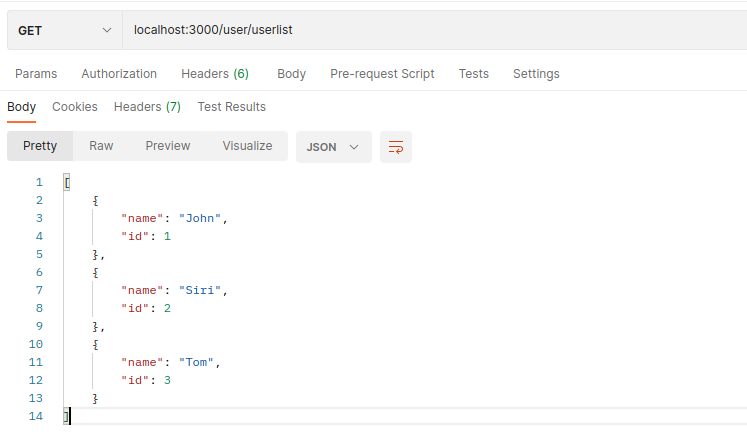

## Modules

NEST 中通过模块来组织结构化的代码逻辑。 

一个Module 通过 `@Module()` 类注解来实现， **app.module.ts** 是项目的 **根模块**。

```js
// src/app.module.ts
import { Module } from '@nestjs/common';

@Module({
  imports: [],
})
export class AppModule {}
```

我们为了更好的组织代码，通常会将各个逻辑块通过 模块 来隔离，例如创建假设我们需要写一个关于用户的逻辑块：

```bash
mkdir /src/user
touch /src/user/user.modules.ts
```

创建一个最基础的Module , 仅仅需要导出一个被`@Module` 所注解的类即可。

```js
// src/user/user.module.ts
import { Module } from "@nestjs/common";

@Module({})
export class UserModule{}
```

现在这个 user Module 仅被创建，但是还未被挂载到 Nest 程序中去， 所以我们需要在 `app.module.ts` 中去引入并注册该 Module:

```js
import { Module } from '@nestjs/common';
import { UserModule } from './user/user.module';

@Module({
  imports: [UserModule],// 注册 UserModule
})
export class AppModule {}
```

现在， Nest 程序就拥有了一个 UserModule了。

> 以上过程，Nest 为我们提供了方便的 CLI 工具
>
> ```bash
> nest g module user
> ```

## Module 和 Controller & Service

我们知道，Controller 在后台应用程序中，用于匹配到来自前端的 request, 并做出后续的分发处理逻辑。 Service 是用于进一步将逻辑分解的，为了更加健硕灵活的分散逻辑处理。 

那么既然我们将不同的 业务逻辑块 通过 `@Module` 来模块组织化了，那么如何将对应的 Controller 和 Service 与之关联呢？

我们先创建 Controller 和 Service :

```bash
touch /src/uses/user.controller.ts
touch /src/user/user.service.ts
```

```js
// src/user/user.controller.ts
import { Controller } from "@nestjs/common";

@Controller()
export class UserController {}
```

```js
// src/user/user.service.ts
import { Injectable } from "@nestjs/common";

@Injectable()
export class UserService{}
```

然后在Module 中，引入并注册 Controller 和 Service

```js
// src/user/user.module.ts
import { Module } from '@nestjs/common';
import { UserController } from './user.controller';
import { UserService } from './user.service';

@Module({
  controllers:[UserController],
  providers:[UserService]
})
export class UserModule {}
```

 现在 我们就将 UserController 和 UserService 和 UserModule 关联起来了。

### 依赖注入

我们刚才提到了 我们会将 Controller 中分散的逻辑分发到 Service 中去处理，但是目前 UserController 和 UserService 还没有关联是做不到的。 

这里涉及到一个依赖注入的内容。 在 文档 Provider 中有介绍。

要将 Service 和 Controller 关联起来，我们来写一个示例用以说明详情：

```js
// src/user/user.controller.ts
import { Controller, Get } from '@nestjs/common';
import { UserService } from './user.service';
@Controller('user')
export class UserController {
  constructor(private userService: UserService) {}
  @Get('userlist')
  findAll(){
     return this.userService.findAll()
  }
}
```

在 UserController 中,我们定义了一个匹配路由 "/user/userlist", 当拦截到请求, Controller 中的对应 Handler 函数(这里是`findAll()`), 将会被执行,我们通过 `this.userService.findAll()` ,将具体的 接口逻辑 分发到了 UserService.

要想该接口正常工作,我们当然还需要在 Service 中去定义一个同名方法:

```js
// src/user/user.service.ts
import { Injectable } from '@nestjs/common';

@Injectable()
export class UserService {
  findAll() {
    return [
      { name: 'John', id: 1 },
      { name: 'Siri', id: 2 },
      { name: 'Tom', id: 3 },
    ];
  }
}
```

现在, 我们就可以正常访问这个接口了:



那么回到 依赖注入的问题上, 这哪里发生了依赖注入呢?

我们在 Controller 中的 constructor 中是这样去关联到 UserService 的

```js
...
  constructor(private userService: UserService) {}
```

在constructor 中通过权限修饰符修饰一个变量 `userService` 这我们知道是一个成员变量声明的简写方式, 可是为什么这里紧接着 把 `UserService` 作为一个 TS 类型对 userService 进行约束呢?

实际上, 我们知道 `UserService` 是一个导出的 Class, 其中定义的 `findAll()` 方法并不是一个被 `static` 修饰的静态成员方法,所以是不能直接通过 Class 进行访问的, 而是要通过其 实例.

其实我们这里必然访问的是实例方法 `findAll()` , 可是为什么没看到 `new UserService` 呢?  

Nest 在后台做了一系列处理, 这中技术叫做 依赖注入, 通过 依赖注入, Nest 让我们不用在关注, UserService 在哪里被实例化, 一旦修改,需要在哪里去做相应变动, 你直接用就可以了.

